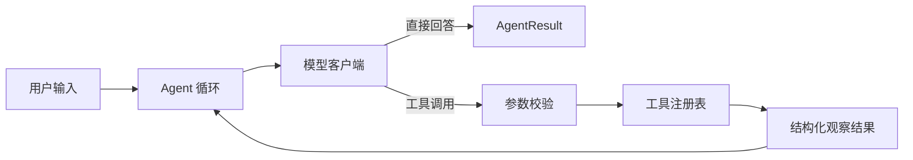

# Mini Agent

一个可测试、可评测的 Python 工具调用 Agent。项目从最小模型调用出发，逐步实现了
多轮对话、工具注册、执行循环、异常处理、重复调用保护和行为评测，适合作为学习
Agent 工程化与面试展示的最小完整项目。

## 项目亮点

- 基于 OpenAI 兼容 Chat Completions 接口，可通过环境变量切换服务地址与模型；
- 支持计算器、时区时间查询和本地 Markdown 笔记搜索；
- 使用 Pydantic 严格校验工具参数，统一返回成功结果或结构化错误；
- 支持多轮对话、最大步骤限制和相同工具调用熔断；
- 将模型异常转换为稳定的 `AgentResult`，便于 CLI、测试和评测复用；
- 使用脚本化假模型完成离线测试，不联网、不消耗 Token；
- 内置 10 条最小评测集，记录通过率、工具轨迹和完整执行过程；
- GitHub Actions 自动执行代码检查、格式检查和全部测试。

## 工作流程



更详细的组件职责和关键取舍见
[架构设计](docs/ARCHITECTURE.md)。

## 快速开始

要求 Python 3.10 及以上，推荐使用 [uv](https://docs.astral.sh/uv/)。

```powershell
git clone https://github.com/ao-per/mini-agent.git
cd mini-agent
Copy-Item .env.example .env
uv sync
```

编辑 `.env`：

```dotenv
ZAI_API_KEY=your_api_key_here
ZAI_BASE_URL=https://open.bigmodel.cn/api/paas/v4/
ZAI_MODEL=glm-5.2
MODEL_TIMEOUT_SECONDS=60
MODEL_MAX_RETRIES=2
NOTES_ROOT=notes
LOG_LEVEL=INFO
```

启动命令行 Agent：

```powershell
uv run python main.py
```

交互命令：

- `/reset`：清空当前对话；
- `exit`、`quit`、`/exit` 或 `/quit`：退出程序。

## 可用工具

| 工具 | 用途 | 关键约束 |
|---|---|---|
| `calculator` | 加、减、乘、除 | 除数不能为零 |
| `current_time` | 查询指定时区当前时间 | 使用 IANA 时区名称 |
| `search_notes` | 搜索本地 Markdown 笔记 | 限制文件数、大小和结果长度 |

## 测试

```powershell
uv run pytest -q
uv run ruff check .
uv run ruff format --check .
```

`tests/fakes.py` 中的 `ScriptedModelClient` 按顺序返回预设响应，并记录 Agent
发送的消息和工具定义。测试不会创建在线模型客户端，因此不会访问网络或消耗 Token。

测试覆盖直接回答、工具调用链、参数错误、模型错误、最大步骤、重复工具调用、多轮对话、
笔记搜索边界和系统提示词策略。

## 评测

`evals/cases.json` 包含 10 条固定案例，覆盖直接回答、工具选择、计算、时间、
笔记搜索、澄清、工具失败和提示词注入防护。

```powershell
uv run python -m evals.run
```

评测会调用 `.env` 配置的真实模型，可能产生 API 费用。结果按关键词、禁止内容、
必需工具、最大步骤数和最大工具调用数评分，报告保存在 `evals/results/`。

## 项目结构

```text
mini-agent/
├── agent.py                 # Agent 执行循环与结构化结果
├── model_client.py          # 模型调用与异常映射
├── registry.py              # 工具注册、校验与执行
├── conversation.py          # 多轮消息状态
├── cli.py                   # 命令行交互
├── tools/                   # 内置工具
├── tests/                   # 离线单元测试与假模型
├── evals/                   # 行为评测集、评分器与运行器
├── docs/                    # 架构和面试材料
└── .github/workflows/       # 持续集成
```

## 设计取舍

- **显式循环而非框架封装**：便于观察消息、工具结果和停止条件，适合学习与调试。
- **依赖最小模型接口**：生产环境使用真实客户端，测试注入假客户端。
- **确定性规则评测优先**：第一版不用另一个模型打分，结果透明且可以稳定复现。
- **每条评测独立会话**：避免前一案例污染后一案例。
- **失败也返回结构化结果**：调用方无需通过捕获异常判断 Agent 状态。

## 当前局限

- 仅提供命令行界面，没有 Web UI 或持久化会话；
- 工具按顺序执行，尚未支持并行工具调用；
- 评测规则以关键词和工具轨迹为主，不能完整判断开放式回答质量；
- 只实现单 Agent，没有任务规划器、记忆检索或多 Agent 协作；
- 尚未进行真实模型评测的历史趋势可视化。

## 后续方向

- 为评测报告增加基线对比和回归阈值；
- 增加流式输出与 Web API；
- 为只读和有副作用的工具增加权限分级；
- 增加结构化日志、运行指标与 trace ID；
- 补充人工评分或模型评分，与规则评分组合使用。

## 面试材料

- [架构设计与关键取舍](docs/ARCHITECTURE.md)
- [面试讲稿、简历表述和常见追问](docs/INTERVIEW.md)
- [发布 GitHub 前检查表](docs/PUBLISH_CHECKLIST.md)

## 许可证

本项目采用 [MIT License](LICENSE)。
