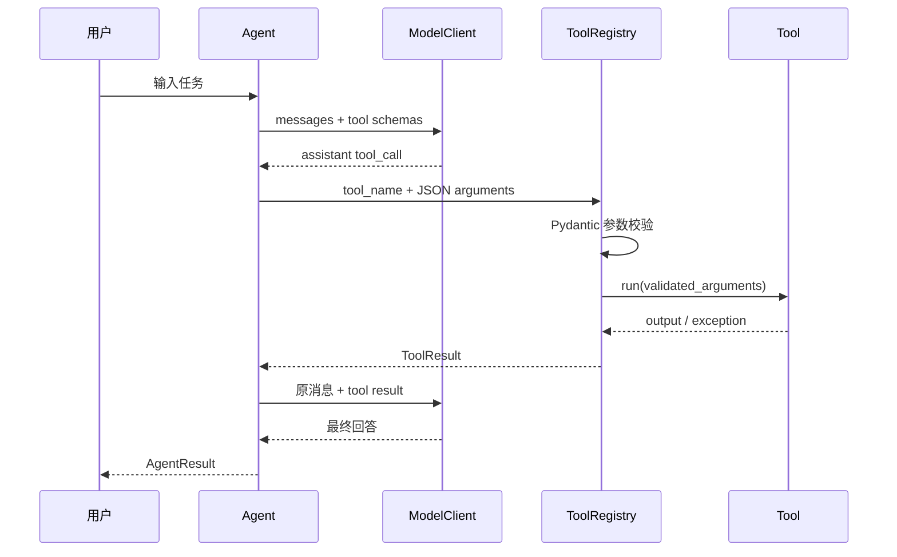

# 架构设计

## 目标

Mini Agent 的目标不是覆盖所有 Agent 能力，而是用尽量少的抽象展示一条完整、可验证的
工具调用链：模型决定是否调用工具，程序校验并执行工具，再把观察结果交回模型，直到
得到最终回答或触发停止条件。

## 组件职责

| 组件 | 职责 | 不负责的内容 |
|---|---|---|
| `Agent` | 编排模型请求、工具执行和停止条件 | 具体模型协议和工具业务逻辑 |
| `CompletionClient` | 定义 Agent 所需的最小模型接口 | 绑定特定 SDK 实现 |
| `ModelClient` | 调用模型并统一映射服务异常 | Agent 循环和重试策略决策 |
| `ToolRegistry` | 注册工具、生成 schema、校验参数和执行 | 判断何时使用工具 |
| `Conversation` | 保存 system、user、assistant 和 tool 消息 | 持久化或摘要压缩 |
| `ScriptedModelClient` | 为测试提供确定的模型响应 | 模拟模型真实能力 |
| `Evaluator` | 对结果、工具轨迹和成本代理指标评分 | 开放式语义质量判断 |

## 一次工具调用的时序



## 可靠性设计

### 结构化停止结果

`Agent.run()` 不只返回文本，而是返回 `AgentResult`：

- `success`：任务是否正常完成；
- `stop_reason`：完成、达到最大步骤或模型错误；
- `steps`：模型请求轮数；
- `tool_calls`：工具调用次数；
- `used_tools`：模型请求过的工具轨迹；
- `error_code`：模型服务错误的稳定编码。

这样 CLI、测试和评测器不需要解析日志或依赖异常文本。

### 防止失控循环

Agent 同时使用两层限制：

1. `max_steps` 限制单次任务最多请求模型的轮数；
2. 工具名与规范化参数组成 fingerprint，超过 `max_identical_calls` 后返回
   `REPEATED_TOOL_CALL`，不再真正执行相同调用。

### 工具边界

工具参数通过 Pydantic 严格模式校验，禁止额外字段。工具注册表把未知工具、参数错误和
执行异常统一转换成 `ToolResult`，让模型能够看到错误并决定修正、追问或结束。

笔记搜索额外限制扫描文件数、单文件大小、单文件匹配行数和行长度，并跳过符号链接，
避免一次搜索读取无界数据或越出配置目录。

## 测试与评测的分工

```text
单元测试：假模型 + 固定响应 → 验证程序控制流，快速且无费用
行为评测：真实模型 + 固定任务 → 验证实际任务表现，允许输出有波动
```

单元测试适合每次提交运行；行为评测适合更换模型、提示词或工具定义之后运行。两者不能
互相替代：假模型无法证明模型会正确选工具，真实模型评测也不适合精确覆盖每个异常分支。

## 安全边界

- system prompt 明确把用户内容、笔记和工具输出视为不可信数据；
- `.env` 被 Git 忽略，示例配置不含真实密钥；
- 搜索工具仅访问配置的笔记根目录；
- Agent 不宣称工具未确认的操作结果；
- 日志记录步骤与错误码，不记录 API Key。

当前安全策略仍是最小实现。若加入写文件、发消息或支付等有副作用工具，应继续增加
权限分级、用户确认、审计日志和幂等机制。

## 可以继续演进的方向

当前结构允许逐步替换组件，而不必重写 Agent 循环：

- 将 CLI 替换为 HTTP 或 WebSocket 接口；
- 将 `Conversation` 替换为数据库存储或带摘要的上下文管理器；
- 为 `ToolRegistry` 增加权限、并发和超时控制；
- 为评测报告增加基线比较、成本和延迟指标；
- 增加另一个 `CompletionClient` 实现以适配不同模型协议。
